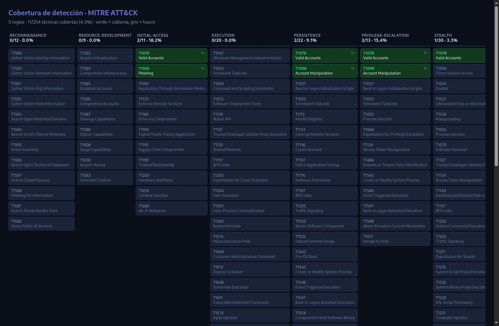

# detection-coverage

Maps your detection rules against the MITRE ATT&CK catalog and shows where your coverage
actually is — and, just as importantly, which rules claim to cover techniques that **don't
exist or were revoked**. It reads rules from files (no tenant required) and produces a
coverage matrix you can hand to a SOC lead.

## The problem

A SOC accumulates detection rules, and everyone assumes they add up to coverage. But
nobody can answer the two questions that matter: *which ATT&CK techniques are we actually
covered for, and where are the holes?* The portal's MITRE view (where it exists) is
Sentinel-only and paid; a folder of rules tells you nothing about the gaps. And a rule
tagged with a technique ID that was **revoked years ago**, or simply mistyped, looks like
coverage on any spreadsheet — while detecting nothing.

## See it in 10 seconds — no tenant required

```bash
git clone https://github.com/earbona23/detection-coverage
cd detection-coverage
python -m coverage.cli --demo                    # console coverage matrix
python -m coverage.cli --demo --html matrix.html # ATT&CK-Navigator-style grid
```



The demo ships a handful of rules — including one that references a **revoked** technique
and a **made-up** ID — so you can see the phantom-coverage detection immediately:

```
Referencias INVÁLIDAS   : 2 (cobertura fantasma)
  ⚠ T1015 (revocada) en «Autenticacion heredada»
  ⚠ T9999 (desconocida) en «Autenticacion heredada»
```

## Use it on your own rules

```bash
pip install -r requirements.txt
python -m coverage.cli ./rules --html coverage.html --json report.json
```

It reads two formats and auto-detects them:

- **detection-as-code YAML** — the `relevantTechniques:` field (the format used by
  [sentinel-detection-as-code](https://github.com/earbona23/sentinel-detection-as-code)).
- **Sentinel analytics rule JSON** — the `techniques` field from exported/ARM rules.

The `diff`-free exit code is useful in CI: `python -m coverage.cli ./rules` exits `1` when
any rule references a nonexistent or revoked technique, so a typo'd technique ID fails the
build instead of quietly becoming fake coverage.

## What makes this honest

- **Coverage is measured against the real catalog, with provenance.** The ATT&CK data is a
  distilled snapshot of the official Enterprise STIX bundle, carrying the source URL, its
  sha256, and the retrieval date. No technique ID is invented here: if it's not in the
  catalog, the tool says so.
- **Phantom coverage is called out, not counted.** A rule referencing a revoked or unknown
  technique adds nothing to the matrix and is reported separately. Inflating a coverage
  number with dead IDs is the exact self-deception a coverage map should prevent.
- **Sub-techniques roll up honestly.** A rule covering `T1114.003` marks its parent
  `T1114` as covered; the denominator is top-level, non-revoked, non-deprecated techniques.
- **This snapshot splits `defense-evasion`** into `stealth` and `defense-impairment`, as
  the source taxonomy does — the tactic names come straight from the catalog, not from a
  hardcoded assumption.

## Limitations

- **Coverage means a rule claims the technique, not that it detects it well.** This maps
  declared coverage; it doesn't judge rule quality or false-positive rate. A green cell is
  "something claims this," not "this is well-detected."
- **It reads what the rules declare.** A rule that detects a technique but doesn't tag it
  won't show as coverage. Good tagging is a prerequisite, and worth it for exactly this
  reason.
- **The ATT&CK snapshot is a point in time.** Refresh it against the current STIX bundle
  periodically; the provenance fields tell you how old the current one is.
- **Two input formats today.** Other rule formats (Elastic, Sigma) are a natural extension,
  and are named here rather than silently unsupported.

## Contributing

Support for another rule format is a welcome addition — normalize it to `{ nombre,
tecnicas }` in `coverage/rules.py` and add a test. Run `pytest -q` and `ruff check .`.

## License

MIT — see [LICENSE](LICENSE).
